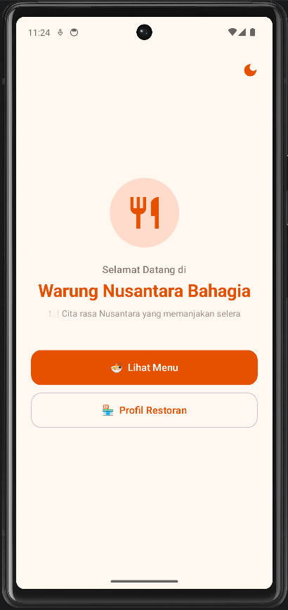
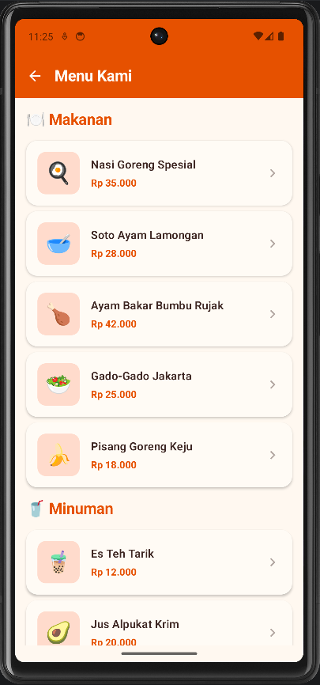
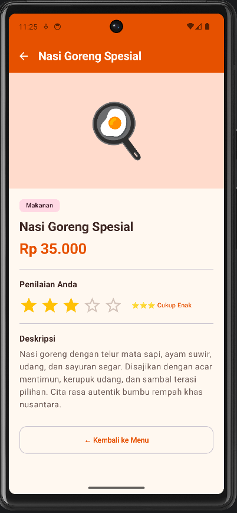
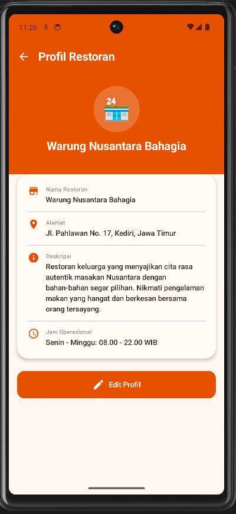
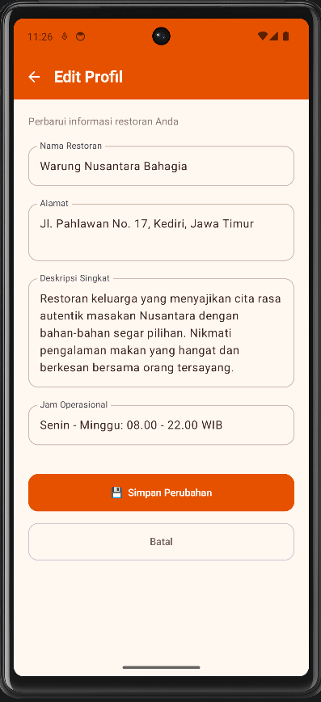

# Aplikasi Restoran - Warung Nusantara Bahagia

Aplikasi Android menu dan profil restoran fiktif, dibangun dengan **Jetpack Compose** dan **Material 3**.

## Screenshot

| Home                                | Menu                          | Detail Menu                       |
| ----------------------------------- | ----------------------------- | --------------------------------- |
|  |  |  |

| Profil                             | Edit Profil                           |
| ---------------------------------- | ------------------------------------- |
|  | 

## Fitur

- 5 layar dengan navigasi: Home, Menu, Detail Menu, Profil, Edit Profil
- Tema gelap/terang dengan toggle (disimpan di SharedPreferences)
- Animasi transisi antar layar (slide + fade)
- Rating bintang interaktif di Detail Menu
- Data profil restoran tersimpan di SharedPreferences

## Tech Stack

- **Bahasa:** Kotlin
- **UI:** Jetpack Compose
- **Design System:** Material 3
- **Navigasi:** Navigation Compose
- **Penyimpanan:** SharedPreferences
